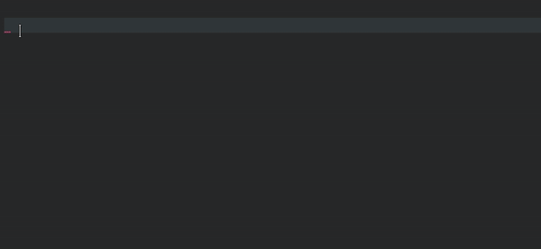

<h1 align="center">
  <br>
    
  <br>
	<br>
  Humane JavaScript Snippets
  <br>
  <br>
</h1>
<h4 align="center">Descriptive, easy to find JavaScript snippets, without nonsense abbreviations.</h4>
<br/>
<p align="center">


<a href="https://ko-fi.com/roboleary"></a>
</p>

Most snippet collections resemble bash aliases. You have a list of abbreviations such as: "imp", "clg", "fre". You must learn these to use them. 🤕

There is a better way!

Snippets are not confined to using a single word as the trigger (prefix). We can be more descriptive, and make them easier to discover.

For example, you want to find an array function, but you're not sure which to use. Just type "arr" and you get a list of array functions with descriptions:



In future, you know you want to use the `find` function, just type "fi" and you will get that as the first suggestion. 🔥

## Activation

These snippets are available for the follow [language identifiers](https://code.visualstudio.com/docs/languages/identifiers):
- `javascript`
- `javascriptreact`
- `typescript`
- `vue`
- `svelte`

## Snippets

You can install the [Snippets Ranger extension](https://marketplace.visualstudio.com/items?itemName=robole.snippets-ranger) to view the full list of snippets inside VS Code.

I didn't repeat any of the builtin JavaScript snippets.

<table>
<thead><tr><th>Prefix</th><th>Name</th><th>Description</th><th>Body</th></tr></thead>
<tbody><tr>
<td>async function</td>
<td>async function</td>
<td>Create an async function. Async functions can contain zero or more await expressions.</td><td><code>async function ${1:name}(${2:parameters}){<br> $3<br>}<br>$0<br></code></td>

</tr><tr>
<td>arrow function,=&gt;</td>
<td>arrow function</td>
<td>Creates an arrow function with optional parameters.</td><td><code>(${1:parameters}) =&gt; {<br> $2<br>}<br>$0<br></code></td>

</tr><tr>
<td>prototype function</td>
<td>prototype function</td>
<td>Creates a prototype function with optional parameters.</td><td><code>${1:object}.prototype.${2:name} = function(${3:parameters}) {<br> $4<br>}<br>$0<br></code></td>

</tr><tr>
<td>iife</td>
<td>Immediately Invoked Function Expression (IIFE)</td>
<td>An IIFE (Immediately Invoked Function Expression) is a JavaScript function that runs as soon as it is defined.</td><td><code>(function () {<br> $1<br>})();<br>$0<br></code></td>

</tr><tr>
<td>array map</td>
<td>Array.prototype.map</td>
<td>Creates a new array populated with the results of calling the provided function on every element in the array. </td><td><code>let ${1:newArray} = ${2:array}.map((${3:item}) =&gt; {<br> return $4<br>}<br>$0<br></code></td>

</tr><tr>
<td>array reduce</td>
<td>Array.prototype.reduce</td>
<td>Executes a user-supplied “reducer” callback function on each element of the array, passing in the return value from the calculation on the preceding element. Perhaps the easiest-to-understand example is to return the sum of all the elements in an array.</td><td><code>let ${1:newArray} = ${2:array}.reduce((accumulator, currentValue) =&gt; {<br> return $4<br>}<br>$0<br></code></td>

</tr><tr>
<td>array filter</td>
<td>Array.prototype.filter</td>
<td>Creates a new array with all elements that pass the test implemented by the provided function.</td><td><code>let ${1:newArray} = ${2:array}.filter((${3:item}) =&gt; {<br> return $4<br>}<br>$0<br></code></td>

</tr><tr>
<td>array find</td>
<td>Array.prototype.find</td>
<td>Returns the value of the first element in the provided array that satisfies the provided testing function.</td><td><code>let ${1:result} = ${2:array}.find((${3:item}) =&gt; {<br> return $4<br>}<br>$0<br></code></td>

</tr><tr>
<td>array some</td>
<td>Array.prototype.some</td>
<td>Tests whether at least one element in the array passes the test implemented by the provided function.</td><td><code>let ${1:result} = ${2:array}.some((${3:item}) =&gt; {<br> return $4<br>}<br>${0}<br></code></td>

</tr><tr>
<td>destructure array</td>
<td>Array destructuring</td>
<td>Assign values from array elements to new variables using destructuring.</td><td><code>const [${1:variables}] = ${2:arrayName};<br>$0<br></code></td>

</tr><tr>
<td>destructure object</td>
<td>Object destructuring</td>
<td>Assign values from object to new variables using destructuring.</td><td><code>const {${1:variables}} = ${2:objectName};<br>$0<br></code></td>

</tr></tbody></table>

## Installation

1. The extension is listed in the [VS Code Marketplace](https://marketplace.visualstudio.com/items?itemName=robole.javascript-snippets) and [Open VSX Marketplace](https://open-vsx.org/extension/robole/markdown-snippets) where you can download or install it directly.
1. From the Command-line: Run the command `code --install-extension robole.javascript-snippets`.

## FAQ

### 1) Where do the standard markdown snippets come from?

There is a set of snippets for the standard markdown syntax installed with VS Code as part of the built-in markdown extension. [This is the source file](https://raw.githubusercontent.com/microsoft/vscode/94c9ea46838a9a619aeafb7e8afd1170c967bb55/extensions/javascript/snippets/javascript.code-snippets).

The [Snippets Ranger extension](https://marketplace.visualstudio.com/items?itemName=robole.snippets-ranger) will show the built-in snippets in a good-looking webview.

### 2) How do I use the snippets?

To insert a snippet, you can just type one of the prefixes in a markdown file, and you will be offered a completion suggestion. The setting `Editor: Snippet Suggestions` controls whether snippets are shown with other suggestions and how they are sorted. By default, they are shown inline.

Alternatively, you can open the Command Palette (`Ctrl+Shift+P`) and run the command "Insert Snippet", which presents you with a list to choose from.

### 3) How do I add shortcuts for the snippets?

Run the command `Preferences: Open Settings (UI)` to open the keyboard shortcuts config. Add an new object to the array such as this:

```JSON
[

	{
		"key": "ctrl+t",
		"mac": "cmd+t",
		"command": "editor.action.insertSnippet",
		"when": "!editorReadonly && editorLangId == javascript",
		"args": {
			"langId": "javascript",
			"name": "arrow function"
		}
	}
]
```

The `args.name` property <u>must exactly match</u> the snippet name.

### 4) Where can I learn more about snippets?

You can read my comprehensive guide on Snippets on FreeCodeCamp: [Visual Studio Code Snippets – the Definitive VS Code Snippet Guide for Beginners](https://www.freecodecamp.org/news/definitive-guide-to-snippets-visual-studio-code/). It's not just for beginners! 😉

## Show gratitude

If you are happy with the extension, please star the repo, and leave a review to help others find it. 🌟🌟🌟🌟🌟

You can [buy me a coffee](https://ko-fi.com/roboleary) if you would like to enable me to make more great open-source software and tutorials. ☕🙏

[](https://ko-fi.com/roboleary)

## Image Attribution

Logo inspired by [Brain by Nithinan Tatah from the Noun Project](https://thenounproject.com/search/?q=brain&i=2452319).
